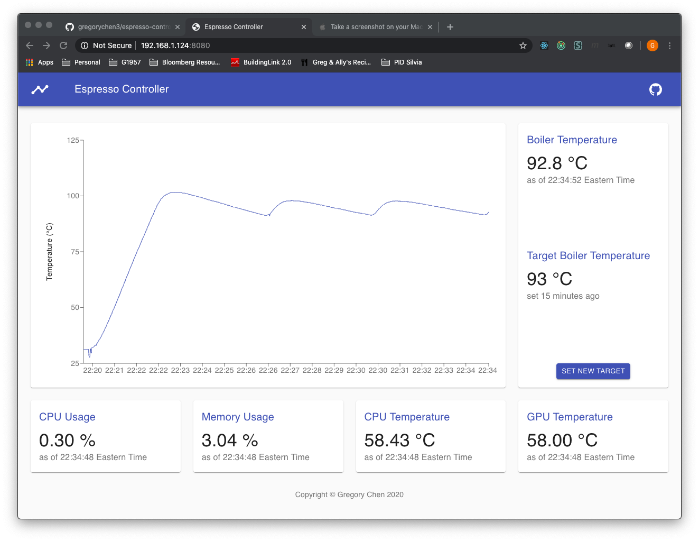
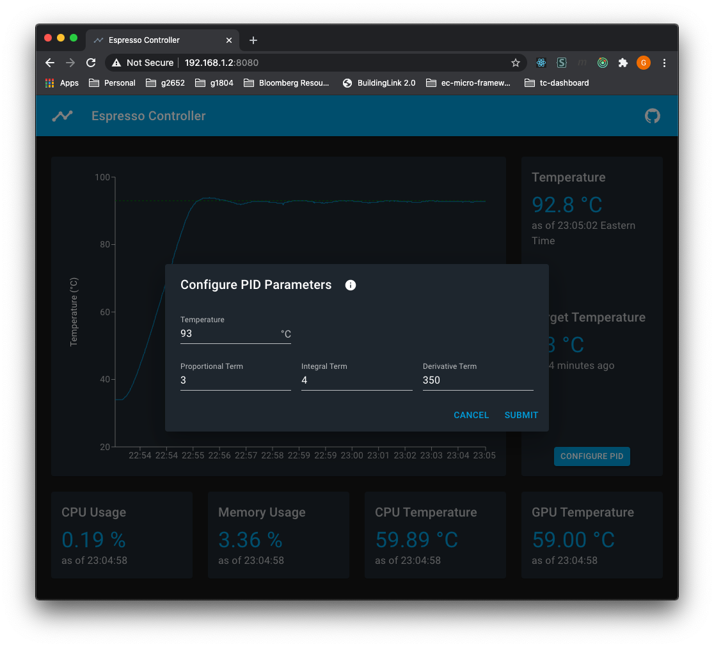
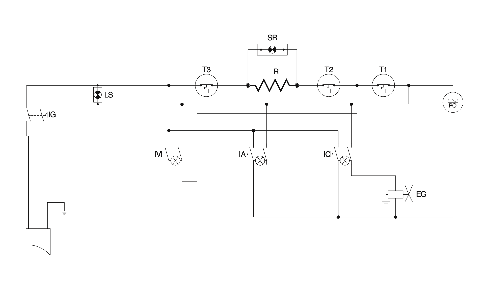
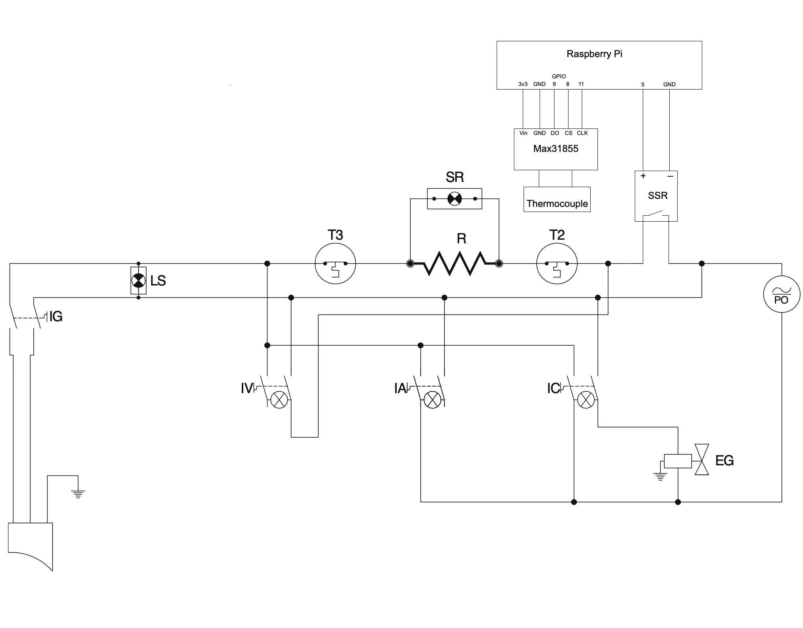

# Espresso Controller

PID temperature control and monitoring for a Rancilio Silvia or comparable espresso machine.



## Table of Contents

- [Tech Stack](#tech-stack)
- [Requirements](#requirements)
- [Installation](#installation)
  - [Requirements](#requirements)
  - [Wiring](#wiring)
  - [Raspi Setup](#raspi-setup)
  - [Control and monitor](#control-and-monitor)
- [Credits](#credits)

## Tech Stack

The application is a single Go binary implementing:

- gRPC API as defined in [espresso.proto](https://github.com/gregorychen3/espresso-controller/blob/master/pkg/espressopb/espresso.proto),
- dashboard web app using React and [Material-UI](https://material-ui.com/), and
- `/metrics` web endpoint for Prometheus scraping

serving on a single port (default 8080) of a Raspberry Pi.

## Installation

### Requirements

- Espresso machine, e.g., [Rancilio Silvia](https://www.ranciliogroupna.com/silvia)
- Raspberry Pi
- [Solid state relay](https://www.amazon.com/dp/B00HV974KC/ref=cm_sw_em_r_mt_dp_U_9WTYEbEA0TNGG)
- [Type K thermocouple](https://www.amazon.com/dp/B07MMLY3PZ/ref=cm_sw_em_r_mt_dp_U_OXTYEb0AVQZWD)
- [MAX31855 thermocouple amplifier](https://www.adafruit.com/product/269)
- [Male blade connectors](https://en.wikipedia.org/wiki/FASTON_terminal#/media/File:Faston_Style_Terminals_Male.jpg)
- Electrical wire
- Thermal tape

### Wiring

Here is the original circuit diagram from the [manual](https://www.ranciliogroupna.com/filebin/images/Downloadables/User_Manuals/Homeline/Silvia_User_Manual_2017.PDF):

Rewire it like this (default gpio pin numbers shown):


### Raspi Setup

1. Follow the Raspberry Pi [Getting Started Guide](https://projects.raspberrypi.org/en/projects/raspberry-pi-getting-started). Be sure to connect it to a wifi network.
2. Take note of the Raspberry Pi's private ip address.

   ```console
   pi@raspberrypi:~ $ hostname -I
   192.168.1.124
   ```

3. Download the application and copy it to the Raspberry Pi.

   ```console
   [~]$ curl -L -o espresso https://github.com/gregorychen3/espresso-controller/releases/download/v0.1.1/espresso
   [~]$ scp ./espresso pi@<ip_addr_from_step_2>:
   ```

4. Start the application (run `./espresso --help` for configuration options)

   ```console
   pi@raspberrypi:~ $ ./espresso -v

        ╓▄▄▄▄▄▄▄▄▄▄▄▄▄▄▄▄▄▄▄▄▄▄▄▄▄▄▄▄▄
       █▀─╓▄         ┌▄▄┌         ▄▄ ╙█
       █ ╫█╠█ ╔▓▓  ▄█▀╟█╙█▄  ╔▓▓ █▌╟█ ██▓▄
       █  ╙╙       █  ╘▀  █▄      ╙╙  █─▐█
       █ ╔█▀█ ╓▄▄  █▌    ▄█  ╓▄▄ ▓██▌ █▄██
       █  ▀▀▀       ╙▀▀▀▀╙       ╙▀▀└ █╨
       ╙▀██▓▓▓▓▓▓██▓▓▓▓▓▓▓▓██▓██▓▓▓██▀╙
    ╔▓▓▓▓██▓▓▓▓▓▓█▌        ▐▌ ▐█▓▓▓██▓▓▓▄
    ╫█▄▄▄▄▄▄▄▄▄▄▄██▄▄▄▄▄▄▄▄██      ▐█ ▄██▄
         ╫▌          █▌▄█          ▐█ █▌▐█
         ╫▌           └└─          ▐█ █▄▐█
         ╫▌      ╒▓▓▓▓▓▓▓▓▓▓▓▓▓▄   ▐█ ╙╙╙└
         ╫▌      ▐█▄▄▄▄▄▄▄▄██  █▌  ▐█
         ╫▌      ╘█        █▀▀▀▀   ▐█
         █▌       ╠█▓▄┌ ▄▄█▌       ▐█
       █▀╙╙╙╙╙╙╙╙╙╙╙╙╙╙╙╙╙╙╙╙╙╙╙╙╙╙╙╙╙█
       █                              █─
       ╙▀▀▀▀▀▀▀▀▀▀▀▀▀▀▀▀▀▀▀▀▀▀▀▀▀▀▀▀▀▀▀

   For more information, go to https://github.com/gregorychen3/espresso-controller

   2020-05-24T16:45:27.372-0400	INFO	espresso/server.go:115	Initializing gRPC server	{"port": 8080}
   2020-05-24T16:45:27.372-0400	INFO	espresso/server.go:123	Initializing gRPC web server	{"port": 8080}
   ```

### Control and monitor

Finally, visit `http://<ip_addr_from_step_2>:8080` using a web browser. Control and monitor the system from the dashboard there.

## Credits

Logo icon made by [catkuro](https://www.flaticon.com/authors/catkuro) from [flaticon.com](https://www.flaticon.com) and converted to ASCII art using [asciiart.club](https://asciiart.club).
